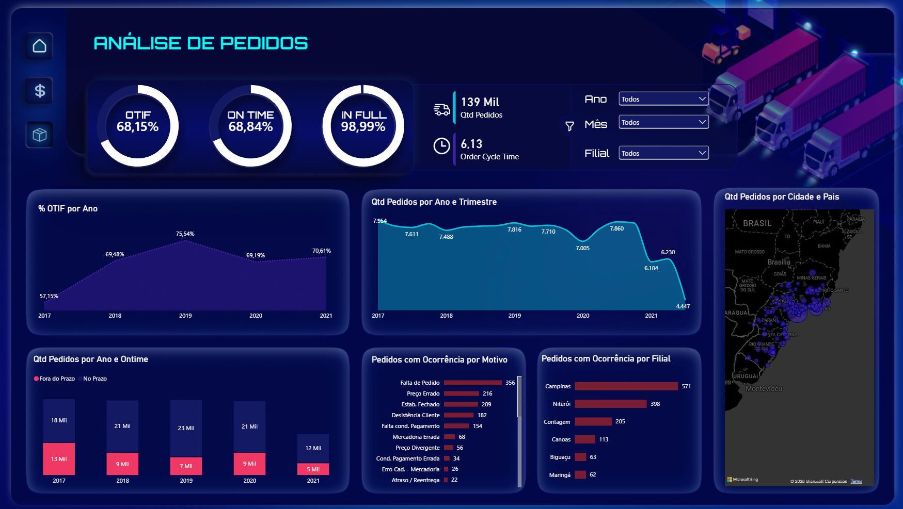
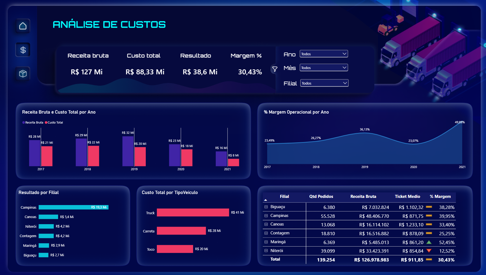

# Painel Logístico-Financeiro 2026: OTIF, Custos e Resultado Operacional

Painel multi-página em Power BI conectando indicadores de entrega (OTIF, On Time, In Full, Order Cycle Time) ao resultado financeiro da operação (receita, custo e margem por filial e tipo de veículo).

## Contexto

Dashboard desenvolvido para dar visibilidade completa da performance logística de uma operação de transporte/distribuição, unindo dois mundos que normalmente ficam separados: a visão operacional de entregas e o impacto financeiro dessas entregas no resultado da empresa.

## Problema de negócio

- Como está a performance de entrega (OTIF, On Time, In Full) e como ela evolui ano a ano?
- Qual o tempo médio de ciclo do pedido (Order Cycle Time) e onde estão os gargalos?
- Quais filiais e tipos de veículo geram melhor ou pior margem operacional?
- Como as ocorrências de entrega (atraso, avaria, etc.) se relacionam com a responsabilidade (transportadora, operação interna) e onde se concentram geograficamente?

## Estrutura do painel

- **Home**: navegação
- **Pedidos**: OTIF, On Time, In Full, Order Cycle Time, ocorrências por motivo/responsabilidade, mapa geográfico, evolução anual
- **Custos**: Receita Bruta, Custo Total, Margem Operacional, Resultado por filial e tipo de veículo, tabela dinâmica

## Prévia do painel

## O que este projeto demonstra

- Modelagem de dados e escrita de medidas DAX (KPIs de % e variação ano a ano)
- Construção de relatório multipágina com navegação por botões e tooltips
- Integração de indicadores operacionais com indicadores financeiros (ponte entre logística e controladoria)
- Storytelling visual: do indicador macro (card) até o detalhe (tabela por filial)

## Ferramentas

Power BI · DAX · Power Query

## Sobre mim

Analista de Dados com 10 anos de experiência em Logística, Transportes e Planejamento Operacional. Atuação em gestão de KPIs, planejamento logístico e estruturação de dashboards com Power BI, Excel Avançado, Power Query e DAX.

📇 [LinkedIn](https://www.linkedin.com/in/danieldinizdados-logística)
